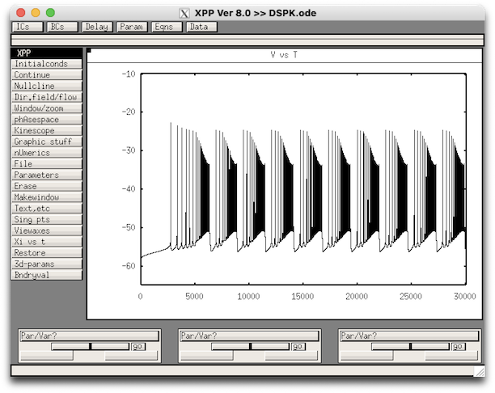

# Model code for the paper

> Currents that modulate spike shape dynamics on 
> multiple timescales induce ramping bursts in model respiratory neurons' by S. R. John, R. 
> Phillips and J. E. Rubin

## Overview

Recordings from pre-Botzinger complex neurons responsible for the inspiratory phase of the respiratory rhythm reveal a ramping burst pattern, starting around the time that the transition from expiration to inspiration begins, in which the spike rate gradually rises until a transition into a high-frequency burst occurs. The spike rate increase along the burst is accompanied by a gradual depolarization of the plateau potential that underlies the spikes. These effects may be functionally important for inducing the onset of inspiration and hence maintaining effective respiration; however, most mathematical models for inspiratory bursting do not capture this activity pattern. Here, we study how the modulation of spike height and afterhyperpolarization via the slow inactivation of an inward current can support various activity patterns including ramping bursts. We use dynamical systems methods designed for multiple timescale systems, such as bifurcation analysis based on timescale decomposition  and averaging over fast oscillations, to generate an understanding of and predictions about the specific dynamic effects that lead to ramping bursts.  We also analyze how transitions between ramping and other activity patterns may occur with parameter changes, which could be associated with experimental manipulations, environmental conditions and/or development.

## Requirements

This model uses both XPPAUT (for simulation) and MATLAB (for optimization).

## Output

